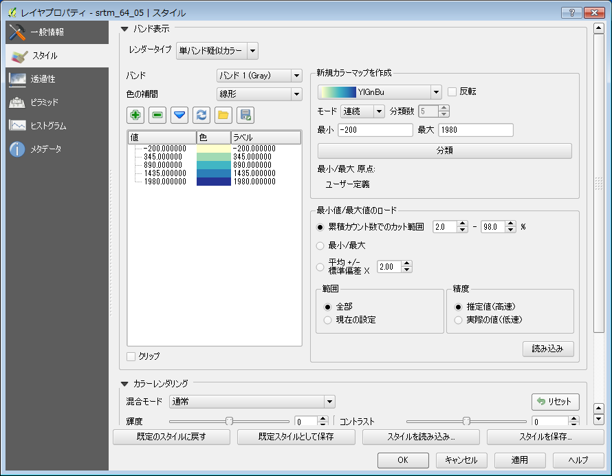

## レイヤにスタイルを設定する

QGISでは、レイヤーにスタイルを適用することで要素の表示方法を設定することができます。以下では、ラスタレイヤとベクタレイヤそれぞれのスタイル設定方法について説明します。

レイヤーのスタイル設定は、左側のレイヤーリストからスタイルの設定を行いたいレイヤーを右クリックし、表示されるポップアップメニューの中から【プロパティ】を選択します。

### ラスタレイヤのスタイル設定

ラスタレイヤーのスタイル設定画面は「バンド表示」の設定項目はレンダータイプによって異なりますが、「カラーレンダリング」、「リサンプリング」の設定項目は共通です。

#### 単バンドグレー

単バンド画像をグレースケールで表示する場合のスタイルの設定を行います。各項目の説明は以下の通りです。

 - グレーバンド

　　単バンドなので、バンド１のみが選択可能です。

 - 色階調

　　[黒から白]、または[白から黒]を選択できます。[黒から白]を選択した場合は、ピクセル値が低い方から高いほうになるにつれて黒から白を割り当てます。

 - 最少／最大

  ピクセル値の最大値、最小値を指定します。後述する「読み込み」ボタンで画像のピクセル値を読み込んで値を設定することができます。また、ユーザがそれぞれの値を指定することもできます。

 - コントラスト拡張

　　表示時のコントラストの拡張方法を指定します。[無し]を指定するとコントラストの拡張を行いません。[最少最大に引き延ばす]を選択した場合は、指定した最小値／最大値にそれぞれ黒と白（またはその逆）を割り当てます。

 - 最少値／最大値のロード

　　ラスタレイヤからどのようにして最小値、最大値を読み込むかの方法を指定します。
　　[累積カウント数でのカット範囲]を選択した場合は、指定したパーセンテージの範囲での最小値、最大値を読み込みます。[最少/最大]は全体の最小値、最大値を読み込みます。[平均+/-標準偏差X]を選択した場合は、平均値±（標準偏差×指定した値）の範囲の値を読み込みます。

  「範囲」で全体を指定した場合はレイヤー全体を対象にし、現在の設定を指定した場合は現在の表示範囲が対象になります。また、「精度」で高速を指定した場合は現在表示されている画像からの推定値を、実際の値を指定した場合は画像をスキャンして最少／最大値を読み取ります。この処理は「読み込み」ボタンを押すと実行されます。

SRTM標高画像の設定例

#### マルチバンドカラー

マルチバンドカラー画像の場合のスタイル設定項目は以下の通りです。

 - Redバンド、Greenバンド、Blueバンド

  どのバンドをどの色に割り当てるかを指定します。

 - コントラスト強調

　　単バンドグレーの設定における「コントラストの拡張」と同じです。

 最小値／最大値のロードは単バンドグレーのものと同じです。

#### 単バンド疑似カラー

単バンド疑似カラーとは、単バンドの画像にグレースケール以外のカラーテーブルを割り当てて疑似的にカラー画像として表示するものです。熱センサ画像などでよく利用されています。

単バンド疑似カラーの設定画面は以下の通りです。

右側の「新規カラーマップを作製」で適用するカラーテーブルとモード（連続または等間隔）、モードで等間隔を選択した場合は分割数、および適用範囲となる最小／最大値を指定し、〔分類〕ボタンを押すと左側に色と適用される値の組が表示されます。
左側のカラーテーブルの値と色とラベルは個別に変更することができます。また、カラーテーブルは保存／読み込みが可能です。

〔色の補間〕は、”線形”ならば各値の色の間を線形で補間します。

〔色の補間〕で”離散的”を選択した場合は各値の間を補間せず、すべて同じ色に設定するので、適用結果は段彩図のようになります。

〔色の補間〕で”厳密”を選択した場合は、カラーテーブルはその色に対応した値と一致しているピクセルにしか彩色されません。これは特定の値のピクセルを抽出したいときに有効です。
下の例はSRTM画像に対して、〔色の補間〕で”厳密”を選択し、値が0.0の箇所を抽出した例です。

#### パレットカラー

パレットカラーは、通常は対象となるラスタレイヤがカラーパレットを持つ場合に使用します。カラーパレットとは番号ごとに色が決められているカラーテーブルのことで、このようなカラーパレットをファイル内に持っている画像の色モードをインデックスカラーモードと呼びます。この場合各ピクセル値にはカラーテーブルの番号が記録されます。GISでは、土地利用図などの主題図で用いると便利です。

QGISでインデックスカラー画像を読み込み、スタイルプロパティのレンダータイプで「パレットカラー」を選択すると、下図のようにファイル内のカラーテーブルが読み込まれます。

値に対応する色は個別に設定することができます。

下図は土地被覆分類結果画像にパレットカラーを適用した例です。

####　共通項目

カラーレンダリングはレイヤの描画についての設定を行います。〔混合モード〕は下のレイヤーの色との混合方法を指定します。”通常”の場合は下のレイヤーとは無関係に描画しますが、それ以外では下のレイヤーとの演算で描画します。
そのほか、明度、彩度、色相の調節、コントラストの協調、強調色の指定などを行うことができます。

リサンプリングは、拡大／縮小時のピクセル内挿法を指定します。QGISでは、縮小画像の描画時にすべてのピクセルを描画しているわけではありません。また、かなり拡大した時は画像のピクセルがキャンバスの解像度を下回るため、ピクセルの矩形が見えるようになります。この時にリサンプリング法で最近傍以外を指定することで滑らかに描画するように設定することができます。
オーバーサンプリングの値は元画像に対する倍率で、たとえば0.1を指定すると元の画像サイズの0.1倍を基準としてリサンプルを行います。

### ベクタレイヤのスタイル設定

（つづく、、、）