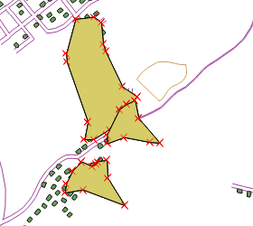
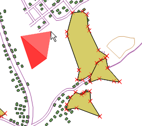
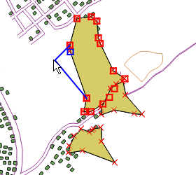
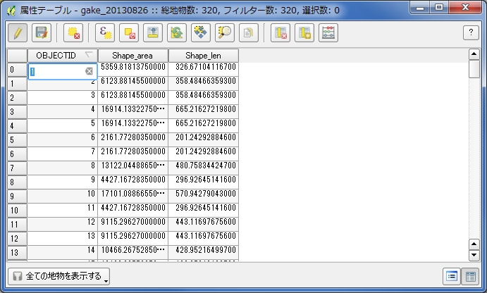

##レイヤを編集する
編集対象とするレイヤを「編集モード」にして、図形形状と属性の追加・修正を行えます。
モードの切り替えは、下記３通りの方法があります。

* 対象レイヤを右クリックして「編集モード切替」

* メニューから「レイヤ」→「編集モード切替」
* ツールバーから「編集モード切替」アイコンを選択

編集モードに切り替わると、レイヤ中の図形の表示が切り替わり、中間点(ノード)も表示されます。

### 図形の追加
メニューから「編集」→「地物の追加」を選択します。この状態で地図面をクリックしていくとレイヤに対応した図形を追加することが出来ます。ポイントのレイヤであれば1箇所をクリックした時点で、ライン・ポリゴンのレイヤであれば数カ所をクリックして図形を作成し右クリックをした時点で、属性入力のダイアログが表示されます。属性入力まで終了すると図形が追加されます。

### 図形の修正
図形の形状を保ったまま移動させたい場合は、メニューから「編集」→「地物の移動」を選択します。対象とする図形をドラッグ操作で移動することが出来ます。

図形の形状を修正したい場合は、メニューから「編集」→「ノードツール」を選択します。対象とする図形のノードをクリックすると、表示が×から□に変更されます。この状態になると、□で表示されているノードを選択出来るようになりますので、ドラッグでの移動や、キーボードからDELボタンでノードの削除を行えます。

図形を削除する場合は、対象とする図形の選択を最初に行います。メニューから「ビュー」→「選択」を選びます。図形を選択する方法は、

* 1個の図形を選択する
* 長方形領域による地物選択 
* ポリゴンによる地物選択
* フリーハンドによる地物選択
* 半径指定による地物選択

などいくつか用意されています。いずれかの方法で対象とする図形を選択してください。  
選択されている図形はハイライト表示されます。選択後、メニューから「編集」→「選択地物の削除」を行います。

### 属性の修正
メニューから「ビュー」→「地物情報表示」を選択後、対象とする図形をクリックすると地物情報のダイアログが表示されます。地物の情報の上で右クリックをするとメニューが表示されますので、「地物編集フォーム」を選択してください。フォームが表示され、地物の属性を編集することが出来ます。

また別な方法として、メニューから「レイヤ」→「属性テーブルのオープン」を選択しておき、属性テーブル上で編集を行う方法もあります。編集したいカラムをダブルクリックすることで属性の編集を行えます。この場合は、上部に表示されている「選択された行のデータに地図をズームする」アイコンで図形を表示し、編集対象としている図形があっているかを確認しながら編集を行いましょう。

### 変更の保存
編集が終了したら編集モードを切り替えて通常に戻します。変更を保存するか聞かれますので、保存するか破棄するかを選択してください。注意点としては、図形・属性の編集を行った時点では変更は保存されていません。明示的に保存を行う必要があります。

